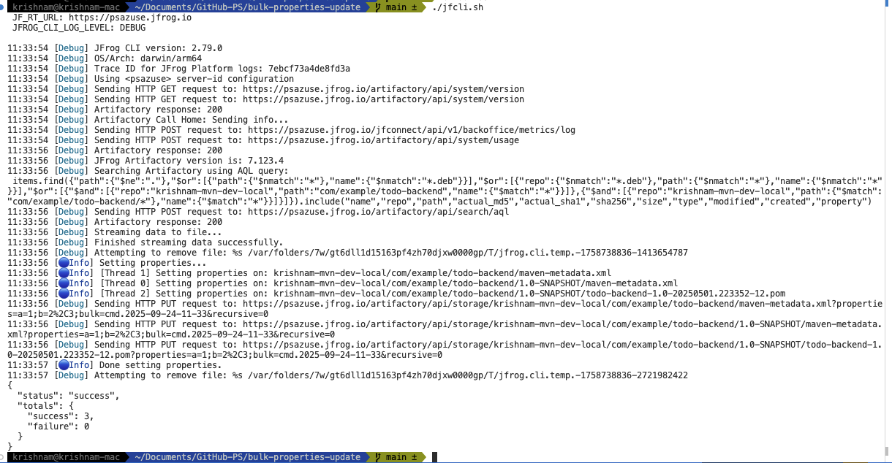
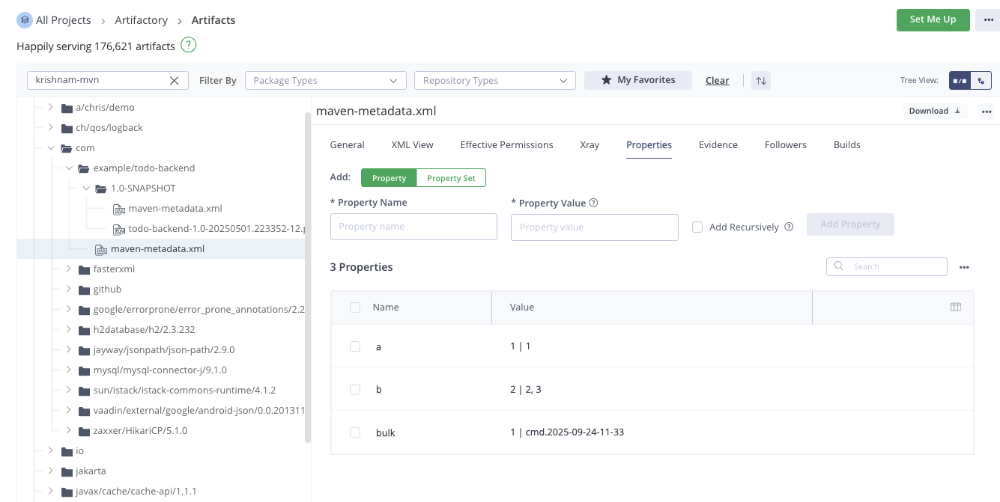
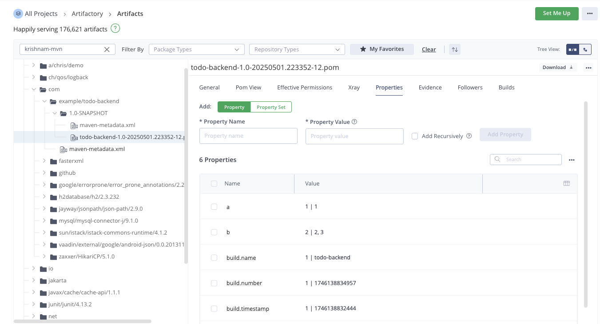
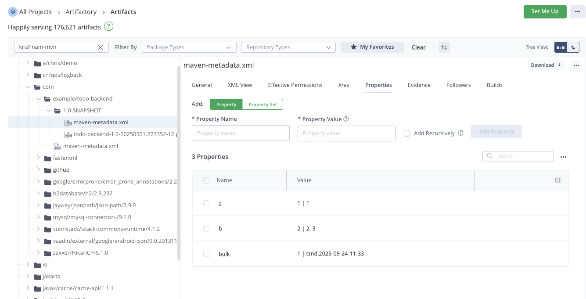

# bulk-properties-update
Update properties for multiple artifacs

## Run
````
./jfcli.sh
````

### CLI
 <br/>

### Artifact Properties
 <br/>
 <br/>
 <br/>


## References
- https://docs.jfrog-applications.jfrog.io/jfrog-applications/jfrog-cli/binaries-management-with-jfrog-artifactory/generic-files#setting-properties-on-files
- https://docs.jfrog-applications.jfrog.io/jfrog-applications/jfrog-cli/binaries-management-with-jfrog-artifactory/generic-files#examples-7